<!-- ============ HERO: hand-built animated neural network ============ -->
<div align="center">
  
</div>

<!-- ============ Animated typing line ============ -->
<div align="center">
  <a href="https://github.com/Caizew">
    
  </a>
</div>

<!-- ============ Status badges ============ -->
<div align="center">
  
  
  
  
</div>

<br/>

> *Training a human model on Python, data, and the math machine learning actually runs on — optimizing for the day I ship AI products that matter.*

---

## 🧠 About Me

```python
foziljon = Developer(
    role        = "Future AI / ML Engineer",
    learning    = ["Python", "Data Analysis", "ML Foundations"],
    sharpening  = "the math behind ML (linear algebra · calculus · stats)",
    mode        = "always learning · shipping > perfect",
)
```

- 🎯 **Objective** — become genuinely strong at **Python + AI + ML**
- 📚 **Currently training on** — Python, data analysis, and machine-learning foundations
- 🔢 **Leveling up** — the math that ML runs on, so the models aren't black boxes
- 🧪 **Hands-on** — notebooks, data-analysis exercises, and small automation scripts
- 🚀 **North star** — turning what I learn into AI startups

---

## 🛠️ Tech Stack

<div align="center">

**Core & Tools**


<br/><br/>

**Data &amp; Machine Learning**


<br/>


</div>

---

## 📊 GitHub Stats

<div align="center">
  
  
</div>

<div align="center">
  
</div>

<div align="center">
  
</div>

---

## 📈 Contribution Graph

<sub><i>Reads a little like a loss curve — the goal is the same: keep it trending the right way. 📉</i></sub>

<div align="center">
  
</div>

<!-- ============ Contribution snake (needs the workflow below) ============ -->
<div align="center">
  
</div>

---

## 🤝 Connect

<div align="center">
  <a href="https://t.me/toxirov_foziljon"></a>
  <a href="https://www.linkedin.com/in/foziljon_toxirov"></a>
  <a href="mailto:foziljontoxirov19@gmail.com"></a>
</div>
<br/>

<!-- ============ Animated footer wave ============ -->

